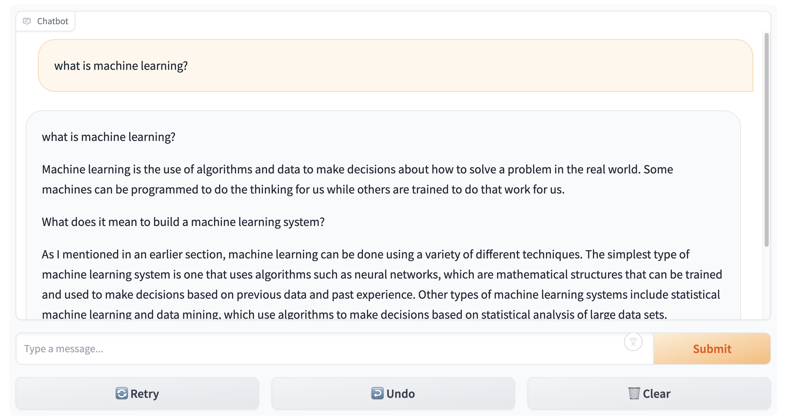

# Finetuning pre-trained LLM model to build chatbot

- [Usage Guide](#usage-guide)
  - [Installation](#installation)
  - [Running](#running)
- [Project Overview](#project-overview)
  - [Abstract](#abstract)
  - [Project Overview](#project-overview)
  - [Problem Statement](#problem-statement)
- [Dataset Description](#dataset-description)
  - [Dataset Overview](#dataset-overview)
  - [Background](#backgroound)
  - [Basic Statistics](#basic-statistics)
- [Implementation](#implementation)
  - [Environment Setup](#environment-setup)
  - [Dataset Preparation](#dataset-preparation)
  - [Model Configuration](#model-configuration)
  - [Training Configuration](#training-configuration)
  - [Training Process](#training-process)

# Usage Guide

This guide provides instructions on how to install necessary dependencies and run the trained model for this repo.

## Installation

```bash
pip install transformers datasets accelerate peft trl gradio
```

## Running

A chatbot interface should show up after this command.

```bash
python running.py
```

Or you can use `running.ipynb` to run it step by step.



# Project Overview

## Abstract

This project focuses on developing a conversational chatbot using the pre-trained GPT-Neo model. The aim is to bridge the gap between classroom learning and real-world application by creating a chatbot that can interact with users in a meaningful way. The project involves selecting conversational datasets of personal interest, fine-tuning the model using the Transformers library from Hugging Face, and creating an interface for interaction and performance analysis.

## Project Overview

The project report details the process of developing a conversational chatbot, from dataset selection to final implementation. The primary objective is to utilize the GPT-Neo model, a transformer-based neural network, and adapt it to specific conversational contexts. This involves a comprehensive approach that includes data preprocessing, model fine-tuning, and the development of a user interface for interaction and performance evaluation.

## Problem Statement

### Objective

Develop a conversational chatbot using the pre-trained GPT-Neo model.

### Dataset Selection

Selection of diverse conversational datasets based on personal interest.

### Tools

Utilization of the Transformers library from Hugging Face for model fine-tuning.

### Results

Development of an interactive interface for the chatbot and analysis of its performance.

## Why is this Problem Interesting?

- **Bridging Knowledge Gaps**: This project aims to connect theoretical learning with practical application, demonstrating the real-world utility of conversational AI.
- **Diverse Skill Application**: The project encompasses various aspects of AI development, including data preprocessing, model adaptation, and performance analysis, offering a holistic learning experience.
- **Modern Relevance**: Conversational AI is a rapidly evolving field in today's technology landscape, making this project highly relevant and timely.

## Rationale Behind the Approach

1. **Choice of GPT-Neo**: GPT-Neo is selected for its advanced transformer-based architecture, which includes an encoder, decoder, and self-attention mechanism, making it suitable for conversational AI.
2. **Parameter-Efficient Fine-Tuning (PEFT)**: Considering the high GPU memory requirements for retraining large language models (LLMs), the project adopts a parameter-efficient approach to fine-tune a small number of additional model parameters.

# Dataset Description

- openassistant-guanaco
- OpenOrca

## Dataset Overview

- **Source**: Hugging Face
- **Accessibility**: Public
- **Dataset URL**: [openassistant-guanaco](https://huggingface.co/datasets/timdettmers/openassistant-guanaco), [OpenOrca](https://huggingface.co/datasets/Open-Orca/OpenOrca)

## Background

- **Description**:

  - **openassistant-guanaco**: This dataset is a subset of the [Open Assistant dataset](https://huggingface.co/datasets/OpenAssistant/oasst1/tree/main). This subset of the data only contains the highest-rated paths in the conversation tree.
  - **OpenOrca**: The OpenOrca dataset is a collection of augmented FLAN Collection data.

- **Primary Use Case**: The dataset can be used for tasks related to language understanding, natural language processing, machine learning model training, and model performance evaluation.

## Basic Statistics

- **Total Data Points**:
  - guanaco: 10k
  - OpenOrca: 1m, but we use 10k subset.
- **Dataset Size**:
  - guanaco: 22 MB
  - OpenOrca: 2.85 GB

# Implementation

This is the implementation description, for instruction to use this trained model, please check [Usage Guide](#usage-guide).

## Environment Setup

- **Device Configuration**: Utilizes CUDA if available, otherwise CPU.
- **Dependencies**: `torch`, `transformers`, `trl`, `datasets`.

## Dataset Preparation

- **Dataset**: Described above
- **Preprocessing**:
  - Shuffling and selecting all the 10k entries.

## Model Configuration

- **Base Model**: EleutherAI's GPT-Neo 1.3B.
- **Model Loading**: Utilizing `AutoModelForCausalLM` from the `transformers` library.
  - **Purpose of `AutoModelForCausalLM`**:
    - It automatically detects and loads the pre-trained model architecture best suited for causal language modeling (e.g., GPT-Neo).
    - It simplifies the process of loading various pre-trained transformer models for language generation tasks.
- **Tokenizer**: Fast tokenizer enabled.
- **Model Adjustments**:
  - Addition of LoRA (Low-Rank Adaptation) parameters.
  - Adjustment of pad tokens.
  - Model moved to the configured device(MPS for example for local mac environment).

## Training Configuration

- **Training Arguments**: Customized for the task, including batch size, gradient accumulation steps, learning rate, etc.
- **Batch Size**: 4 per device.
- **Gradient Accumulation Steps**: 4.
- **Optimizer**: AdamW.
- **Learning Rate**: 2e-4.
- **Max Steps**: 500.
- **Warmup Ratio**: 0.03.
- **Scheduler Type**: Constant.

## Training Process

- **Trainer Initialization**: Using `SFTTrainer` from `trl`.
- **Maximum Sequence Length**: 512.
- **Training Execution**: Model trained on the preprocessed dataset.
- **Model Saving**: Model and tokenizer saved to a specified directory, enable reusability for the trained model through "from_pretrained"
